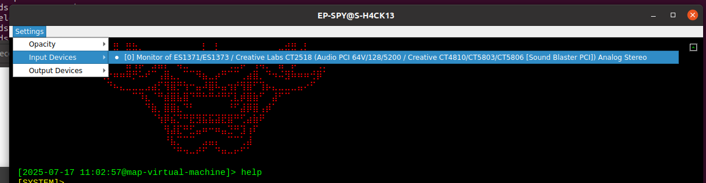

# EP-SPY

Based on GI6E encoding, a wireless radio communication espionage tool to protect your privacy.

1. Coded pseudo-protocol to prevent content decryption
2. Impossible to trace via network, resisting official surveillance
3. Wireless audio broadcasting for covert information transmission
4. Supports real-time audio monitoring and decoding
5. Automatic switching and compatibility across multiple devices
6. One-click generation and playback of encrypted signals
7. Complete history logging and playback

**Возможно, тебе стоит знать, в кого направлен дуло.**


# Install

```bash
$ ./install.sh
$ pip install -r requirement.txt
```


PS: If running on a Windows host, please first install `./install/vbc/VBCABLE_Setup_x64.exe`. Windows typically cannot directly monitor the default speakers, so a virtual audio device is required.

# Usage

```bash
$ python epspy.py
```


```
> help
```


**GRID encoding**

```
> code test
```


**GRID encoded wav audio**

```
> wav test
```


**Broadcast GRID encoded message**

Select audio output device


```
> send test
```


**Receive GRID broadcast message**

Select audio input device



```
> recv
```


**Anonymous sent message history**

```
> history
```


---


```bash
⠀⠀⠀⠀⠀⠀⠀⠀⠀⠀⠀⠀⠀⠀⠀⠀⠀⠀⠀⠀⠀⠀⠀⠀⠀⠀⠀⠀⠀⠀
⠀⠀⠀⠀⠀⠀⠀⠀⠀⢀⣀⣀⣀⣀⣀⠀⠀⠀⠀⠀⠀⠀⠀⠀⠀⠀⠀⠀⠀⠀
⠀⠀⠀⠀⠀⠀⠀⢰⣿⣿⣿⣿⣿⣿⣿⣿⣿⣿⣿⣷⣶⣤⣀⠀⠀⠀⠀⠀⠀⠀
⠀⠀⠀⠀⠀⠀⠀⢀⠙⠿⢿⣿⣿⣿⣿⣿⣿⣿⣿⣿⣿⣿⠿⠀⠀⠀⠀⠀⠀⠀
⠀⠀⠀⠀⠀⠀⠀⠀⣷⣶⣤⣄⣈⣉⣉⣉⣉⣉⣉⣉⣁⣤⡄⠀⠀⠀⠀⠀⠀⠀
⠀⠀⠀⠀⠀⠀⠀⠀⣿⣿⣿⣿⣿⣿⣿⣿⣿⣿⣿⣿⣿⣿⡇⠀⠀⠀⠀⠀⠀⠀
⠀⠀⠀⠀⠀⠀⠀⠀⣿⣿⣿⣿⣿⣿⣿⣿⣿⣿⣿⣿⣿⣿⡇⠀⠀⠀⠀⠀⠀⠀
⠀⠀⠀⠀⠀⠀⢀⠀⣿⣿⣿⣿⣿⣿⣿⣿⣿⣿⣿⣿⣿⣿⡇⠀⠀⠀⠀⠀⠀⠀
⠀⠀⢀⣠⣶⣾⡏⢀⡈⠛⠻⠿⢿⣿⣿⣿⣿⣿⠿⠿⠟⠛⢁⠀⢶⣤⣀⠀⠀⠀
⠀⢠⣿⣿⣿⣿⡇⠸⣿⣿⣶⣶⣤⣤⣤⣤⣤⣤⣤⣶⣶⣿⡿⠂⣸⣿⣿⣷⡄⠀
⠀⢸⣿⣿⣿⣿⣿⣦⣄⡉⠛⠛⠛⠿⠿⠿⠿⠛⠛⠛⢉⣁⣤⣾⣿⣿⣿⣿⡷⠀
⠀⠀⠙⢿⣿⣿⣿⣿⣿⣿⣿⣷⣶⣶⣶⣶⣶⣶⣾⣿⣿⣿⣿⣿⣿⣿⡿⠛⠁⠀
⠀⠀⠀⠀⠈⠙⠛⠿⠿⢿⣿⣿⣿⣿⣿⣿⣿⣿⡿⠿⠿⠿⠛⠛⠉⠁⠀⠀⠀⠀
⠀⠀⠀⠀⠀⠀⠀⠀⠀⠀⠀⠀⠀⠀⠀⠀⠀⠀⠀⠀⠀⠀⠀⠀⠀⠀⠀
```