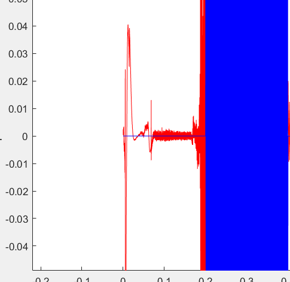
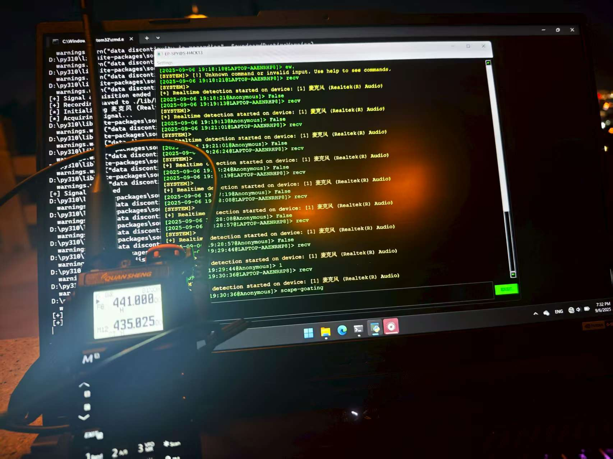

# EP-SPY V3.0

Based on GI6E encoding, a wireless radio communication espionage tool to protect your privacy.

https://github.com/MartinxMax/gi6e

1. Coded pseudo-protocol to prevent content decryption
2. Impossible to trace via network, resisting official surveillance
3. Wireless audio broadcasting for covert information transmission
4. Supports real-time audio monitoring and decoding
5. Automatic switching and compatibility across multiple devices
6. One-click generation and playback of encrypted signals
7. Complete history logging and playback

**Возможно, тебе стоит знать, в кого направлен дуло.**


 
---

# Issues Resolved in This Version

By analyzing the audio in MATLAB, it was observed that the payload in the real data is basically consistent. However, the received data seems to be **shifted by approximately 20 ms**.


After manually shifting the original data by 20 ms, the alignment becomes clear:


In summary, the issue is **not simply a timing offset**. The main challenge is **how to eliminate the initial interference pulse** in the signal.



After multiple experiments, the solution was to **intentionally add two interference pulses at the beginning of the code**. During reception, the correct code range is then extracted.

Fortunately, after implementing this approach, the **transmission success rate exceeded 90%**.


---
 


# Communication Test

---

**Warning:**

1. Radio transmission codes are encrypted to evade network surveillance. Even if intercepted, the original information cannot be reconstructed.
2. Do not transmit from a single location for extended periods, otherwise you may be tracked using trilateration.
3. Ensure sufficient radio power and that the transmission distance meets requirements.

---

## Radio Configuration \[UVK5]

1. After turning on the radio, set the audio to maximum, then rotate **4–5 units to the right**.
2. Frequency can be arbitrary; avoid commonly used public channels to reduce interference.
3. Use a `K plug to 2.5mm jack cable` to connect the `UVK5` to the `PC`.


---

## Computer Configuration

Set the microphone input volume to **30%**.


---


## Configure EP-SPY

Run:

```bash
$ python epspy.py
```


### RX

* This tab usually selects **Microphone** as the input device.


* After selection, enter the command:

```bash
recv
```

to enter receive mode.


---

### TX

* This tab usually selects **Headphones** as the output device.


* After selection, enter the command:

```bash
send <STR>
```

to transmit.


---

## 200-Meter Test Results

**Transmitting Side**


**Receiving Side**



 
---

# How to Troubleshoot Communication Failures

In the project’s `matlab` folder, there is a `test.m` file. Please use MATLAB to **compare the differences between the two audio files**.

Possible causes of communication failure:

1. The **PC or radio audio level is set too high**, causing distortion or clipping.
2. The signal is **interfered by other radio transmissions**.
3. **Radio transmission power is insufficient**, or the signal is attenuated by obstacles or other entities, preventing it from reaching the desired distance and resulting in excessive white noise.


 
---

# Install

```bash
$ pip install --upgrade pip
$ ./install.sh
$ pip install -r requirement.txt --config-settings --confirm-license= --verbose
```


PS: If running on a Windows host, please first install `./install/vbc/VBCABLE_Setup_x64.exe`. Windows typically cannot directly monitor the default speakers, so a virtual audio device is required.

# Usage

```bash
$ python epspy.py
```


```
> help
```


**GRID encoding**

```
> code test
```


**GRID encoded wav audio**

```
> wav test
```


**Broadcast GRID encoded message**

Select audio output device


```
> send test
```


**Receive GRID broadcast message**

Select audio input device


```
> recv
```


**Anonymous sent message history**

```
> history
```


---


```bash
⣿⣿⣿⣿⣿⣿⣿⣿⣿⣿⣿⣿⣿⣿⣿⣿⣿⣿⣿⣿⣿⣿⣿⣿⣿⣿⣿⡿⡿⣿⣿⣿⣿⣿⣿⣿⣿⣿⣿⣿⣿⣿⣿⣿⣿⣿⣿⣿⣿⣿⣿⣿⣿⣿⣿⣿⣿⣿⣿⣿⣿⣿⣿⣿⣿
⣿⣿⣿⣿⣿⣿⣿⣿⣿⣿⣿⣿⣿⣿⣿⣿⣿⣿⣿⣿⣿⣿⠟⠛⠋⠀⠀⠀⠀⠀⠀⠉⠉⠂⠙⠻⢿⣿⣿⣿⣿⣿⣿⣿⣿⣿⣿⣿⣿⣿⣿⣿⣿⣿⣿⣿⣿⣿⣿⣿⣿⣿⣿⣿⣿
⣿⣿⣿⣿⣿⣿⣿⣿⣿⣿⣿⣿⣿⣿⣿⣿⣿⣿⣿⡿⠋⠁⠀⠀⠀⠀⠀⠀⠀⠀⠀⠀⠀⠀⠀⠀⠀⢻⣿⣿⣿⣿⣿⣿⣿⣿⣿⣿⣿⣿⣿⣿⣿⣿⣿⣿⣿⣿⣿⣿⣿⣿⣿⣿⣿
⣿⣿⣿⣿⣿⣿⣿⣿⣿⣿⣿⣿⣿⣿⣿⣿⣿⣿⣿⠋⠀⠀⠀⠀⠀⠀⠀⠀⠀⠀⠀⠀⠀⠀⠀⠀⠀⠨⢿⣿⣿⣿⣿⣿⣿⣿⣿⣿⣿⣿⣿⣿⣿⣿⣿⣿⣿⣿⣿⣿⣿⣿⣿⣿⣿
⣿⣿⣿⣿⣿⣿⣿⣿⣿⣿⣿⣿⣿⣿⣿⣿⣿⣿⡇⠀⠀⠀⠀⠀⠀⠀⠀⠀⠀⠀⠀⠀⠀⠀⠀⠀⠀⠀⠀⠙⢿⣿⣿⣿⣿⣿⣿⣿⣿⣿⣿⣿⣿⣿⣿⣿⣿⣿⣿⣿⣿⣿⣿⣿⣿
⣿⣿⣿⣿⣿⣿⣿⣿⣿⣿⣿⣿⣿⣿⣿⣿⣿⣿⡀⠀⠀⠀⠀⠀⢀⡀⠀⠀⠀⠀⠀⠀⢀⣠⣶⣶⢀⣀⠄⣴⣮⣿⣿⣿⣿⣿⣿⣿⣿⣿⣿⣿⣿⣿⣿⣿⣿⣿⣿⣿⣿⣿⣿⣿⣿
⣿⣿⣿⣿⣿⣿⣿⣿⣿⣿⣿⣿⣿⣿⣿⣿⣿⣿⣇⠀⠀⠀⠀⠀⠘⣦⡐⣀⠠⠀⢀⡴⣯⢿⣽⣿⡇⣷⣶⣿⣿⣿⣿⣿⣿⣿⣿⣿⣿⣿⣿⣿⣿⣿⣿⣿⣿⣿⣿⣿⣿⣿⣿⣿⣿
⣿⣿⣿⣿⣿⣿⣿⣿⣿⣿⣿⣿⣿⣿⣿⣿⣿⣿⣿⣇⠀⠀⠀⢶⡞⣧⣻⠬⠳⠞⡿⢿⡿⡿⠿⠟⠇⣿⣿⣿⣿⣿⣿⣿⣿⣿⣿⣿⣿⣿⣿⣿⣿⣿⣿⣿⣿⣿⣿⣿⣿⣿⣿⣿⣿
⣿⣿⣿⣿⣿⣿⣿⣿⣿⣿⣿⣿⣿⣿⣿⣿⣿⣿⣿⡟⠠⢄⠀⡝⠮⡑⠠⠀⠀⠀⠀⠀⣈⠀⠀⠀⠀⢴⠉⣿⣿⣿⣿⣿⣿⣿⣿⣿⣿⣿⣿⣿⣿⣿⣿⣿⣿⣿⣿⣿⣿⣿⣿⣿⣿
⣿⣿⣿⣿⣿⣿⣿⣿⣿⣿⣿⣿⣿⣿⣿⣿⣿⣿⣿⡄⠂⡀⡀⢻⣦⣍⡩⢀⡀⢄⡀⠀⣼⣧⠀⠄⡰⠹⣸⣿⣿⣿⣿⣿⣿⣿⣿⣿⣿⣿⣿⣿⣿⣿⣿⣿⣿⣿⣿⣿⣿⣿⣿⣿⣿
⣿⣿⣿⣿⣿⣿⣿⣿⣿⣿⣿⣿⣿⣿⣿⣿⣿⣿⣿⣯⣀⡢⠁⠘⣽⣿⢿⣄⣍⣂⡀⠾⠛⠹⠛⣸⣶⢿⣿⣿⣿⣿⣿⣿⣿⣿⣿⣿⣿⣿⣿⣿⣿⣿⣿⣿⣿⣿⣿⣿⣿⣿⣿⣿⣿
⣿⣿⣿⣿⣿⣿⣿⣿⣿⣿⣿⣿⣿⣿⣿⣿⣿⣿⣿⣿⣷⣵⡅⡀⠈⠚⢫⢻⡺⠛⠛⠠⠄⠀⡀⠉⠙⣾⣿⣿⣿⣿⣿⣿⣿⣿⣿⣿⣿⣿⣿⣿⣿⣿⣿⣿⣿⣿⣿⣿⣿⣿⣿⣿⣦
⣿⣿⣿⣿⣿⣿⣿⣿⣿⣿⣿⣿⣿⣿⣿⣿⣿⣿⣿⣿⣿⣿⣿⣠⠀⠀⠀⠃⡳⣀⢦⡔⠈⠋⢑⡦⢀⣿⣿⣿⣿⣿⣿⣿⣿⣿⣿⣿⣿⣿⣿⣿⣿⣿⣿⣿⣿⣿⣿⣿⣿⣿⠻⣿⣿
⣿⣿⣿⣿⣿⣿⣿⣿⣿⣿⣿⣿⣿⣿⣿⣿⣿⣿⣿⣿⣿⣿⣿⡗⣆⠀⠀⠂⠁⠘⠓⠻⠟⠿⠛⠀⠀⠻⣿⣿⣿⣿⣿⣿⣿⣿⣿⣿⣿⠿⣿⣿⣿⣿⣿⣿⣿⣿⣿⣿⣉⢦⢡⢀⠻
⣿⣿⣿⣿⣿⣿⣿⣿⣿⣿⣿⣿⣿⣿⣿⣿⣿⣿⣿⣿⣿⣿⣿⡟⢊⡖⢤⠀⡀⠀⠀⠀⠀⠀⠀⠀⠀⠀⠈⠉⠙⠻⠿⣿⣿⣿⢣⢙⠯⢖⡈⢧⣭⢋⡟⢯⠛⡽⣻⢟⠻⡛⢶⠢⠄
⣿⣿⣿⣿⣿⣿⣿⣿⣿⣿⣿⣿⣿⣿⣿⣿⣿⣿⣿⣿⣿⣿⡿⠁⠀⠸⢡⠆⡐⢀⠀⠄⠀⠀⠀⠀⠀⠀⠀⠀⠀⠀⠀⠀⠉⠉⠀⠊⠐⠀⠘⡄⠫⢷⡌⠠⣌⠰⣋⠎⠓⡈⢄⠠⠀
⣿⣿⣿⣿⣿⣿⣿⣿⣿⣿⣿⣿⣿⣿⣿⣿⣿⣿⣿⣿⠿⠋⠀⠀⠀⠀⠀⣊⠐⠠⣈⠀⡀⠀⠀⠀⠀⠀⠀⠀⠀⠀⠀⠀⠀⠀⠀⠀⠀⠀⠁⠀⠁⠌⣨⣷⠧⠓⠌⠢⢁⠘⠎⠡⠀
⣿⣿⣿⣿⣿⣿⣿⣿⣿⣿⣿⣿⣿⣿⣿⣿⣿⡿⠟⠁⠀⠀⠀⠀⠀⠀⣀⠢⣋⡵⣎⡵⠀⠀⠀⠀⠀⠀⠀⠀⠀⠀⠀⠀⠀⠀⠀⠀⠀⠀⠀⠀⠀⠀⠑⠫⠌⢁⠠⠁⡀⠠⢠⢁⠂
⣿⣿⣿⣿⣿⣿⣿⣿⣿⣿⣿⣿⣿⣿⡿⠋⠉⠀⠀⠀⠀⠀⠀⠀⠀⠀⠙⠳⠽⠗⠉⠀⠀⠀⠀⠀⠀⠀⠀⠀⠀⠀⠀⠀⠀⠀⠀⠀⠀⠀⠀⠀⠀⠀⠀⠀⠀⠀⢢⠱⡌⠐⠀⠂⠀
⣿⣿⣿⣿⣿⣿⣿⣿⣿⣿⣿⣿⣿⠋⠀⠀⠀⠀⠀⠀⠀⠀⠀⠀⠀⠀⠀⠀⠀⠀⠀⠀⠀⠀⠀⠀⠀⠀⠀⠀⠀⠀⠀⠀⠀⠀⠀⠀⠀⠀⠀⠀⠀⠀⠀⠀⠀⠀⠈⠃⠄⠀⠀⠀⠀
⣿⣿⣿⣿⣿⣿⣿⣿⣿⣿⣿⠟⠁⠀⠀⠀⠀⠀⠀⠀⠀⠀⠀⠀⠀⠀⠀⠀⠀⠀⠀⠀⠀⠀⠀⠀⠀⠀⠀⠀⠀⠀⠀⠀⠀⠀⠀⠀⠀⠀⠀⠀⠀⠀⠀⠀⠀⠀⠀⠐⠈⠠⠁⢀⠤
⣿⣿⣿⣿⣿⣿⣿⣿⣿⣿⣿⡀⠀⠀⠀⠀⠀⠀⠀⠀⠀⠀⠀⠀⠀⠀⠀⠀⠀⠀⠀⠀⠀⠀⠀⠀⠀⠀⠀⠀⠀⠀⠀⠀⠀⠀⠀⠀⠀⠀⠀⠀⠀⠀⠀⠀⠀⠀⠀⠀⠈⡁⠌⡈⣤
⣿⣿⣿⣿⣿⣿⣿⣿⣿⣿⣿⠁⠀⠀⠀⠀⠀⠀⠀⠀⠀⠀⠀⠀⠀⠀⠀⠀⠀⠀⠀⠀⠀⠀⠀⠀⠀⠀⠀⠀⠀⠀⠀⠀⠀⠀⠀⠀⠀⠀⠀⠀⠀⠀⠀⠀⠀⠀⠀⠀⠈⠁⡠⣪⣿
⣿⣿⣿⣿⣿⣿⣿⣿⣿⣿⣿⠂⠀⠀⠀⠀⠀⠀⠀⠀⠀⠀⠀⠀⠀⠀⠀⠀⠀⠀⠀⠀⠀⠀⠀⠀⠀⠀⠀⠀⠀⠀⠀⠀⠀⠀⠀⠀⠀⠀⠀⠀⠀⠀⠀⠀⠀⠀⠀⠀⠀⣾⣾⣿⣿
⣿⣿⣿⣿⣿⣿⣿⣿⣿⣿⣿⡇⠀⠀⠀⠀⠀⠀⠀⠀⠀⠀⠀⠀⠀⠀⠀⠀⠀⠀⠀⠀⠀⠀⠀⠀⠀⠀⠀⠀⠀⠀⠀⠀⠀⠀⠀⠀⠀⠀⠀⠀⠀⠀⠀⠀⠀⠀⠀⠀⠘⣿⣿⣿⣿
⣿⣿⣿⣿⣿⣿⣿⣿⣿⣿⣿⠇⠀⠀⠀⠀⠀⠀⠀⠀⠀⠀⠀⠀⠀⠀⠀⠀⠀⠀⠀⠀⠀⠀⠀⠀⠀⠀⠀⠀⠀⠀⠀⠀⠀⠀⠀⠀⠀⠀⠀⠀⠀⠀⠀⠀⠀⠀⠀⠀⠀⠹⠟⠉⠒
⣿⣿⣿⣿⣿⣿⣿⣿⣿⣿⣿⠀⠀⠀⠀⠀⠀⠀⠀⠀⠀⠀⠀⠀⠀⠀⠀⠄⠀⠀⠀⠀⠀⠀⠀⠀⠀⠀⠀⠀⠀⠀⠀⠀⠀⠀⠀⠀⠀⠀⠀⠀⠀⠀⠀⠀⠀⠀⠀⠀⠀⠀⣿⣿⣿
⣿⣿⣿⣿⣿⣿⣿⣿⣿⣿⣿⠀⠀⠀⠀⠀⠀⠀⠀⠀⠀⠀⠀⠀⠀⠀⠀⠀⠀⠀⠀⠀⠀⠀⠀⠀⠀⠀⠀⠀⠀⠀⠀⠀⠀⠀⠀⠀⠀⠀⠀⠀⠀⠀⠀⠀⠀⠀⠀⠀⠀⢰⣿⣿⣿
⣿⣿⣿⢿⣻⢿⣻⣿⣿⣿⡟⠀⠀⠀⠀⠀⠀⠀⠀⠀⠀⠀⠀⠀⠀⠀⠀⠀⠀⠀⠀⠀⠀⠀⠀⠀⠀⠀⠀⠀⠀⠀⠀⠀⠀⠀⠀⠀⠀⠀⠀⠀⠀⠀⠀⠀⠀⠀⠀⠀⠀⢸⣿⣿⣿
⣳⢾⡽⢮⡵⣎⢷⣹⠻⡹⠀⠀⠀⠀⠀⠀⠀⠀⠀⠀⠀⠀⠀⠀⠀⠀⠀⠀⠀⠀⠀⠀⠀⠀⠀⠀⠀⠀⠀⠀⠀⠀⠀⠀⠀⠀⠀⠀⠀⠀⠀⠀⠀⠀⠀⠀⠀⠀⠀⠀⠀⠀⢻⣿⣿
⣯⢿⡿⢳⣙⣾⣷⣬⣵⣶⣷⡄⠀⠀⠀⠀⠀⠀⠀⠀⠀⠀⠀⠀⠀⠀⠀⠀⠀⠀⠀⠀⠀⠀⠀⠀⠀⠀⠀⠀⠀⠀⠀⠀⠀⠀⠀⠀⠀⠀⠀⠀⠀⠀⠀⠀⠀⠀⠀⠀⠀⠀⠈⢍⡰
⣿⣿⣿⣿⣿⣿⣿⣿⣿⣿⣿⡇⠀⠀⠀⠀⠀⠀⠀⠀⠀⠀⠀⠀⠀⠀⠀⠀⠀⠀⠀⠀⠀⠀⠀⠀⠀⠀⠀⠀⠀⠀⠀⠀⠀⠀⠀⠀⠀⠀⠀⠀⠀⠀⠀⠀⠀⠀⠀⠀⠀⠀⠀⢆⠒
⣿⣿⣿⣿⣿⣿⣿⣿⣿⣿⣿⣷⠀⠀⠀⠀⠀⠀⠀⠀⠀⠀⠀⠀⠀⠀⠀⠀⠀⠀⠀⠀⠀⠀⠀⠀⠀⠀⠀⠀⠀⠀⠀⠀⠀⠀⠀⠀⠀⠀⠀⠀⠀⠀⠀⠀⠀⠀⠀⠀⠀⠀⠈⢎⡑
⣿⣿⣿⣿⣿⣿⣿⣿⣿⣟⣿⠿⠀⠀⠀⠀⠀⠀⠀⠀⠀⠀⠀⠀⠀⠀⠀⠀⠀⠀⠀⠀⠀⠀⠀⠀⠀⠀⠀⠀⠀⠀⠀⠀⠀⠀⠀⠀⠀⠀⠀⠀⠀⠀⠀⠀⠀⠀⠀⠀⠀⠀⣨⣄⡤
⣿⣿⣿⣿⣿⣿⣿⣿⣿⣿⣿⡀⠀⠀⠀⠀⠀⠀⠀⠀⠀⠀⠀⠀⠀⠀⠀⠀⠀⠀⠀⠀⠀⠀⠀⠀⠀⠀⠀⠀⠀⠀⠀⠀⠀⠀⠀⠀⠀⠀⠀⠀⠀⢀⣀⣀⠀⠀⠀⠀⠀⠐⠓⠋⠈
```